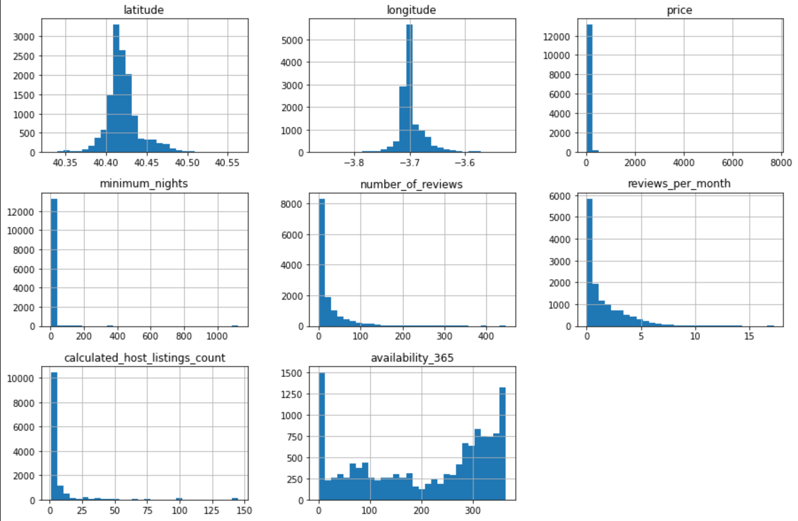
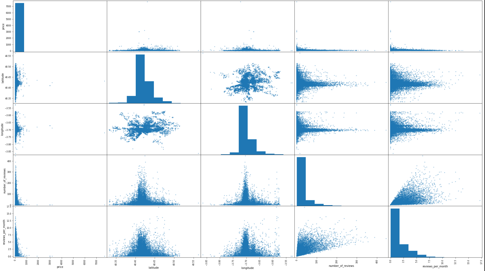
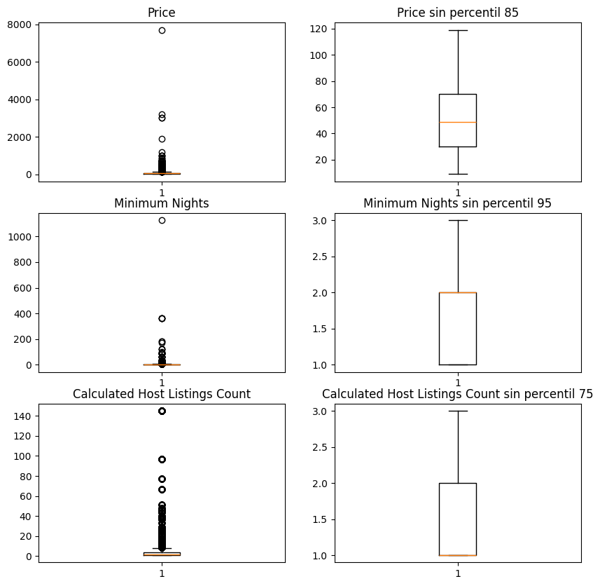

# Machine Learning on AIRBNB data

In this repository we will apply some Machine Learning to an Airbnb dataset of houses in Madrid. The ML we will apply:

* Naives Bayes
* K-Nearest Neighbors (KNN) 
* Decision Trees
* Support Vector Machines (SVM)
  * Classifier:
    * LinearSVC 
    * LinearSVC with RBF Kernel
  * Regression:
    * LinearSVR
    * LinearSVR with RBF Kernel

## Preprocessing

Some of the tasks we will do in preprocessing:

* **Distribution analysis**
  

* **Correlation Matrix**

 

* **Box and whisker plot**

* **Scale values (StandardScaler)**
* **Trasform Pipeline (for scaling)**
* **Removing attributes**

